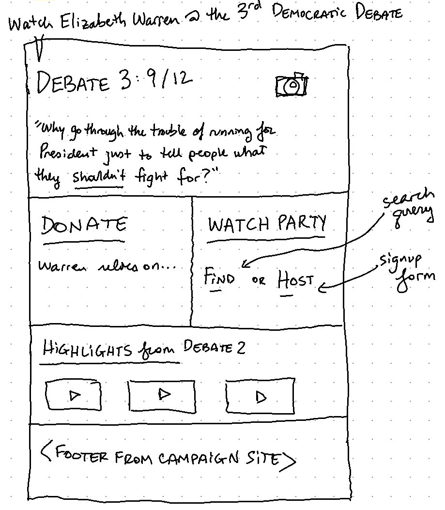
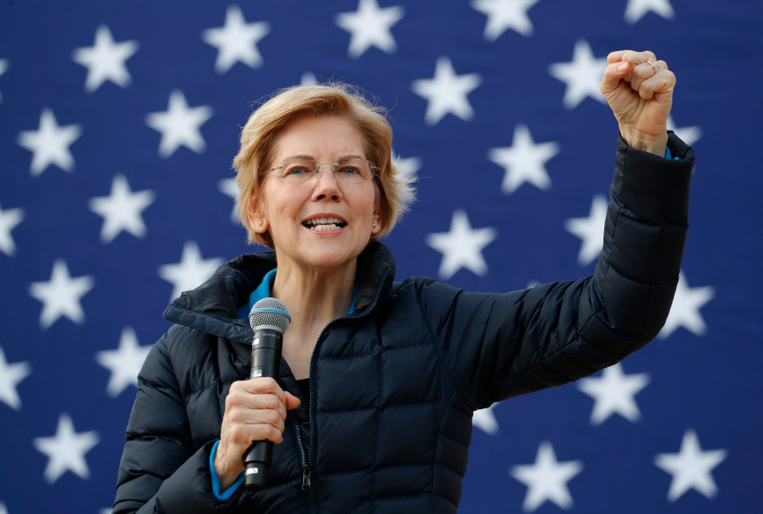

# Warren 2020: Debate 3 Microsite

## Prospective Layout

## Source Content

> **Banner image**

Source article: https://www.dailynews.com/2019/02/18/elizabeth-warren-to-speak-in-glendale-on-monday/

> **What was the "Join Warren for the Debate?" prize like last time?**
https://twitter.com/TeamWarren/status/1159583618731335680

<blockquote class="twitter-tweet" data-lang="en">
Ellie and Maggie won the <a href="https://twitter.com/hashtag/TeamWarren?src=hash&amp;ref_src=twsrc%5Etfw">#TeamWarren</a> contest to come to the second Democratic presidential debate—and they got to wish <a href="https://twitter.com/ewarren?ref_src=twsrc%5Etfw">@ewarren</a> luck before it started! Here&#39;s a look at their whirlwind day. <a href="https://t.co/P8tY8JXigY">pic.twitter.com/P8tY8JXigY</a>
&mdash; Team Warren (@TeamWarren) <a href="https://twitter.com/TeamWarren/status/1159583618731335680?ref_src=twsrc%5Etfw">August 8, 2019</a></blockquote>

> **Donation Page**
https://secure.actblue.com/donate/ew-homepage-launch-050919

> **Find a Watch Party**
https://events.elizabethwarren.com/?date=2019-09-12T04%3A00%3A00.000Z&event_type=15&is_virtual=false

> **Host a Watch Party**
https://events.elizabethwarren.com/event/create/

> **Video Highlights**
- Tough finding short clips, need to do more digging

> **Footer**
- [`CampaignFooter.jsx`](./CampaignFooter.jsx) is the HTML from the campaign page's footer, but I didn't try to get any of the styling.