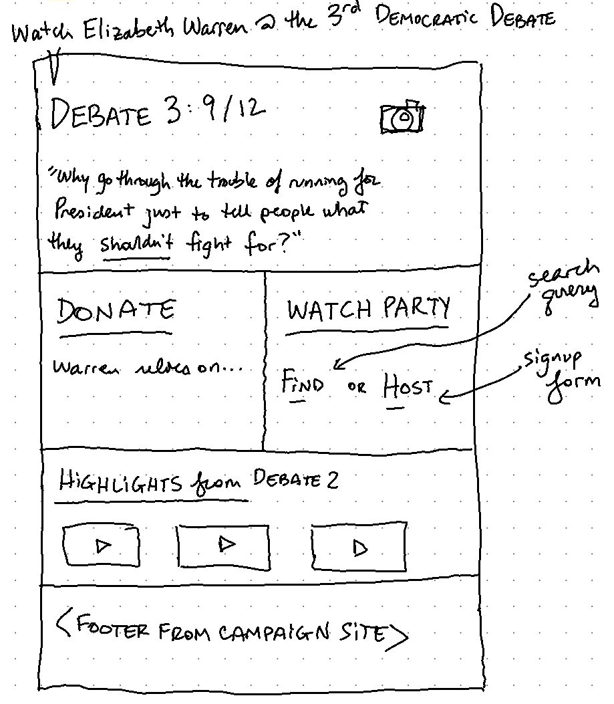

# Warren 2020: Debate 3 Microsite

Tiny `create-react-app` designed to be deployed thru GitHub Pages.  This one is to hype Elizabeth Warren at the September 12th debates, but it's designed to be easily adapted toward other issues.

## Prospective Layout

## Potential Themes
- Massively
  - Demo: https://html5up.net/massively
  - React component conversion: https://github.com/meddlin/rushinglabs-react-massively
- Forty
  - Demo: https://lufevida.github.io/html5up-forty/
  - Raw HTML5 Template: https://github.com/lufevida/html5up-forty

## Source Content

### Banner image

Source article: https://www.dailynews.com/2019/02/18/elizabeth-warren-to-speak-in-glendale-on-monday/

### What was the "Join Warren for the Debate?" prize like last time?

<blockquote class="twitter-tweet" data-lang="en">
Ellie and Maggie won the <a href="https://twitter.com/hashtag/TeamWarren?src=hash&amp;ref_src=twsrc%5Etfw">#TeamWarren</a> contest to come to the second Democratic presidential debate—and they got to wish <a href="https://twitter.com/ewarren?ref_src=twsrc%5Etfw">@ewarren</a> luck before it started! Here&#39;s a look at their whirlwind day. <a href="https://t.co/P8tY8JXigY">pic.twitter.com/P8tY8JXigY</a>
&mdash; Team Warren (@TeamWarren) <a href="https://twitter.com/TeamWarren/status/1159583618731335680?ref_src=twsrc%5Etfw">August 8, 2019</a></blockquote>

https://twitter.com/TeamWarren/status/1159583618731335680

### Donation Page
https://secure.actblue.com/donate/ew-homepage-launch-050919

### Find a Watch Party
https://events.elizabethwarren.com/?date=2019-09-12T04%3A00%3A00.000Z&event_type=15&is_virtual=false

### Host a Watch Party
https://events.elizabethwarren.com/event/create/

### Video Highlights

https://www.youtube.com/watch?v=ayDyh8fjtww

<iframe width="560" height="315" src="https://www.youtube.com/embed/ayDyh8fjtww?controls=0" frameborder="0" allow="accelerometer; autoplay; encrypted-media; gyroscope; picture-in-picture" allowfullscreen></iframe>

### Footer
- [`CampaignFooter.jsx`](./CampaignFooter.jsx) is the HTML from the campaign page's footer, but I didn't try to get any of the styling.